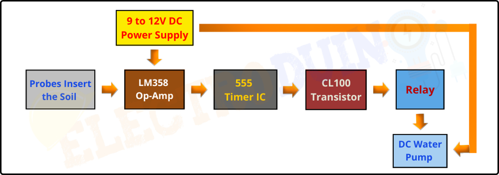
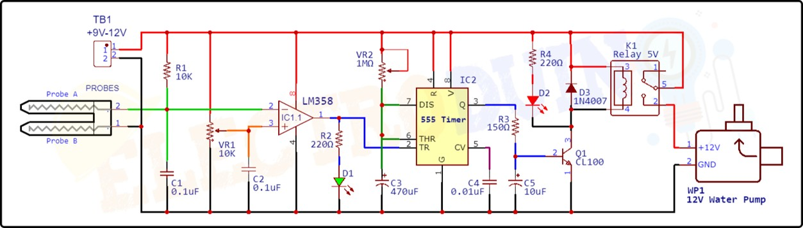

# 🌱 Automated Plant Watering System (IoT)

## 📖 Overview
The **Automated Plant Watering System** is an IoT-based solution designed to maintain optimal soil moisture levels for plants without manual intervention. Built using the **ESP8266 NodeMCU**, this system monitors soil conditions in real-time and automatically activates a water pump when moisture drops below a specific threshold. 

This project addresses the challenges of modern urban gardening, water conservation, and agricultural automation.

## ✨ Key Features
*   **Automatic Irrigation:** Continuously monitors soil resistance and activates the pump only when the soil is dry.
*   **IoT Integration:** Real-time monitoring of data via the **Blynk App**.
*   **Environmental Monitoring:** Tracks Temperature and Humidity using the **DHT11 Sensor**.
*   **Smart Display:** **OLED 16x2 screen** displays live status (Moisture %, Temp, Pump Status).
*   **Motion Detection:** Integrated **PIR Sensor** pauses watering if human/animal motion is detected nearby (safety feature).
*   **Manual Override:** Tactile push button to force start/stop the system for maintenance.

## 📐 System Design
Here is the architectural overview and circuit connection of the system.

### 1. Block Diagram

### 2. Circuit Diagram

## 🛠️ Hardware Components
*   **Microcontroller:** ESP8266 NodeMCU (Wi-Fi enabled)
*   **Sensors:** 
    *   Soil Moisture Sensor (Resistive)
    *   DHT11 (Temperature & Humidity)
    *   PIR Motion Sensor
*   **Actuators:** 
    *   5V Relay Module
    *   Submersible Mini Water Pump
*   **Display:** 0.96" OLED Display (I2C)
*   **Power:** 18650 Lithium-Ion Battery
*   **Other:** Breadboard, Jumper wires, Tubing.

## 💻 Software & Tech Stack
*   **IDE:** Arduino IDE
*   **Language:** C++ (Embedded)
*   **IoT Platform:** Blynk Cloud
*   **Libraries Used:**
    *   `ESP8266WiFi`
    *   `BlynkSimpleEsp8266`
    *   `DHT` (for Temp/Humidity)
    *   `Adafruit_SSD1306` (for OLED)

## 🚀 How to Run
1.  **Hardware Setup:** Connect the components as per the **Circuit Diagram** above. Ensure the relay is connected to the pump and the ESP8266 digital pins.
2.  **Library Installation:** Open Arduino IDE and install the required libraries (Blynk, DHT, Adafruit GFX/SSD1306).
3.  **Blynk Configuration:**
    *   Create a new project in the Blynk App.
    *   Copy the `AUTH TOKEN` and paste it into the code.
    *   Update the `SSID` and `PASSWORD` in the code with your Wi-Fi credentials.
4.  **Upload Code:** Flash the `.ino` file to the ESP8266 NodeMCU.
5.  **Monitor:** Open the Serial Monitor (Baud 9600) or the Blynk App to view real-time data.

## 👥 Team & Contributors
This project was developed as part of the Mini Project-II (2025) at **Mepco Schlenk Engineering College**.

*   **Niranjan M.P.**
*   **Sriram V.**

## 🔮 Future Scope
*   Integration with **AI/ML** to predict watering schedules based on weather forecasts.
*   **Solar Charging** implementation for a completely off-grid solution.
*   Expansion to **Hydroponic** systems.

---
*If you find this project useful, please give it a star! ⭐*
